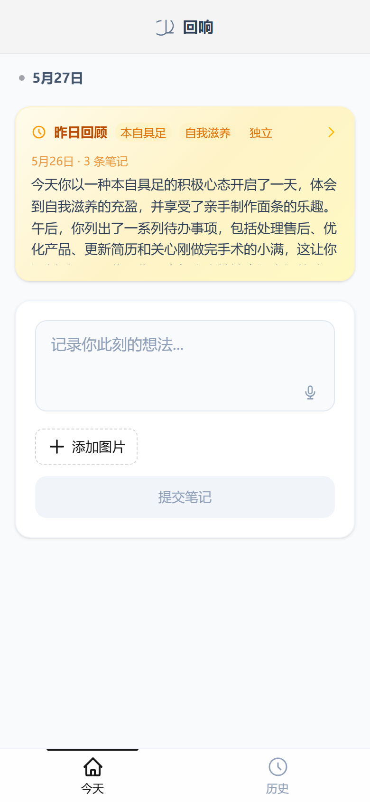
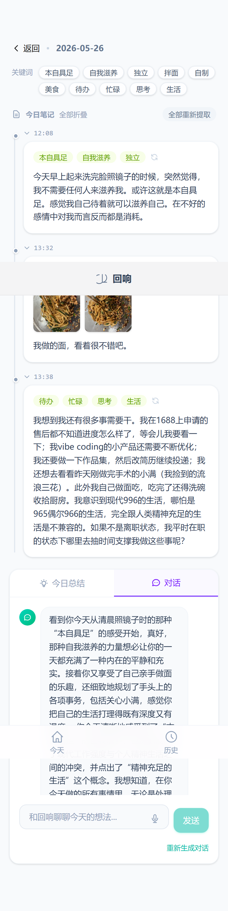
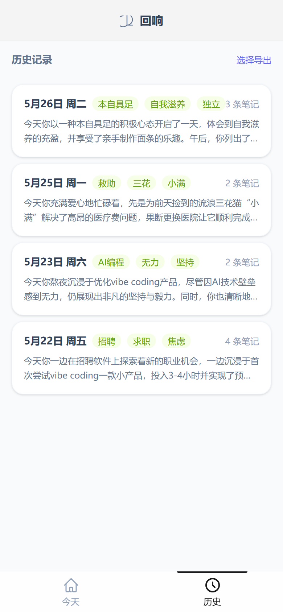
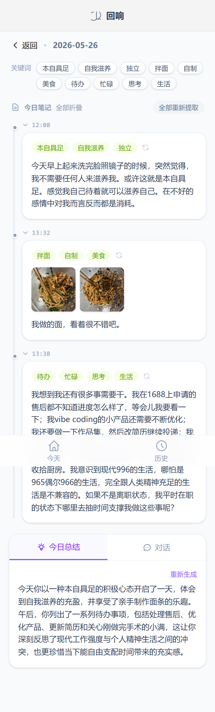
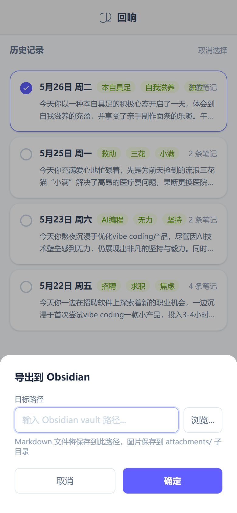

# 回响 / Daily Reflect

> An AI-powered journal that doesn't just store your thoughts — it reflects with you.

写下手记、拍照上传，AI 助手"思语"会阅读你一天的记录，生成总结，并与你展开深度对话。不是笔记工具，是思考伙伴。

## Why this exists

Most journaling apps are digital paper — you write, you leave, you forget. I built Daily Reflect because I wanted a journal that **talks back**: one that notices patterns I miss, asks questions I'm avoiding, and helps me reflect more deeply than I would on my own.

The name "回响" (huí xiǎng) means "echo" or "resonance" — the AI is an echo of your own thoughts, resonating back with new perspective.

## Features

### Capture
- **Text notes** — plain text, markdown-friendly, up to 10,000 characters per note
- **Image upload** — snap handwritten notes, whiteboard sketches, or receipts; auto-converts HEIC → JPEG, strips EXIF for privacy, resizes to max 2048px
- **Voice input** — dictate in Chinese, auto-punctuated by AI (`MediaRecorder` with Gemini fallback)

### Reflect
- **AI daily summary** — Gemini reads all your notes (including text in images) and writes a 2–3 sentence synthesis of your day
- **Deep discussion** — the AI assistant "思语" engages you in conversation about your reflections, always ending with a follow-up question
- **Keyword extraction** — per-note and full-day keyword extraction, surfaced as chips in the UI

### Review
- **History timeline** — browse past entries by date, with summary preview and keyword chips
- **Yesterday recap** — homepage card shows yesterday's summary, so you start each day with context

### Export
- **One-click export to Obsidian** — select dates, pick a vault folder, and export as clean Markdown files with rewritten image references
- **File-based storage** — all data is stored as plain Markdown files with YAML frontmatter, readable by any editor, no lock-in

### PWA
- Installable on iOS/Android home screen, works offline, mobile-first responsive design

## Screenshots

| | |
|---|---|
|  |  |
| *Today's journal — write or dictate, AI does the rest* | *Deep conversation with 思语 about your day* |
|  |  |
| *Browse past entries with keyword previews* | *Full entry view: notes, summary, and discussion* |
|  | |
| *One-click export to Obsidian vault* | |

## Architecture

```
Browser (PWA)
    │
    ├── React 19 + TypeScript + Tailwind CSS 4
    │   ├── TanStack Query (server state, optimistic updates)
    │   └── React Router (SPA routing)
    │
    ▼
FastAPI (Python 3.12)
    ├── /api/entries     — CRUD, summarize, discuss, keywords
    ├── /api/voice       — transcribe, punctuate
    ├── /api/images      — serve uploaded images
    ├── /api/export      — Obsidian export + folder picker
    │
    ├── Gemini 2.5 Flash — summarization, discussion, image recognition, speech-to-text
    │
    └── Storage
        ├── Markdown files with YAML frontmatter (entries)
        └── Flat files (images, organized by year/month)
```

### Design decisions worth mentioning

- **No database.** All journal data is stored as human-readable Markdown files. You can open them in any editor, grep them, back them up with any tool, or version-control them.
- **Chinese-first.** All prompts, UI strings, and error messages are in Chinese. The AI assistant persona is crafted for Chinese-language conversation, not translated from English.
- **File-based images.** Images are stored alongside entries in a predictable path structure — no blob storage, no database blobs.
- **Optimistic UI.** Discussion messages appear instantly in the chat before the server confirms, keeping the conversation feeling real-time.
- **Layered features.** Summary, discussion, and keywords are separate API calls that build on each other — you can use just the parts you want.

## Tech Stack

| Layer | Technology |
|---|---|
| Frontend | React 19, TypeScript, Tailwind CSS 4, Vite 8 |
| State | TanStack React Query |
| Backend | FastAPI (Python 3.12), uvicorn |
| AI | Gemini 2.5 Flash (multimodal) |
| Storage | Markdown files + flat images |
| PWA | vite-plugin-pwa, Workbox (NetworkFirst strategy) |
| Image processing | Pillow, pillow-heif (HEIC→JPEG, EXIF strip, resize) |

## Quick Start

### Prerequisites

- Python 3.12+
- Node.js (LTS)
- [Gemini API key](https://aistudio.google.com/apikey) (free tier is plenty for personal use)

### Setup

```bash
# 1. Clone
git clone https://github.com/<your-username>/daily-reflect.git
cd daily-reflect

# 2. Configure
echo "GEMINI_API_KEY=your_key_here" > server/.env

# 3. Install
cd server && pip install -r requirements.txt
cd ../client && npm install

# 4. Run both
# Terminal 1
cd server && uvicorn app.main:app --reload

# Terminal 2
cd client && npm run dev
```

Open `https://localhost:5173` (self-signed cert for PWA support). On mobile, use your LAN IP — `http://<your-ip>:5173`.

## Project Structure

```
daily-reflect/
├── client/                 # React SPA + PWA
│   └── src/
│       ├── pages/          # HomePage, HistoryPage, EntryDetailPage
│       ├── components/     # entry/, reflection/, history/, layout/, common/
│       ├── hooks/          # React Query hooks (10 hooks)
│       ├── services/       # API client
│       └── strings.ts      # All Chinese UI copy
├── server/                 # FastAPI backend
│   └── app/
│       ├── api/            # entries, images, voice, export
│       ├── services/       # gemini_service, entry_service, image_service, obsidian_service
│       ├── storage/        # Markdown file storage backend
│       └── models/         # Pydantic schemas
└── scripts/                # Standalone export script
```

## What's next

- [ ] Multi-user support with session-based isolation
- [ ] Docker deployment for easy self-hosting
- [ ] Email digest (weekly/monthly reflection summaries)
- [ ] Sentiment tracking over time

---

Built with Claude Code. Not a tutorial project — this is my actual daily journal.
